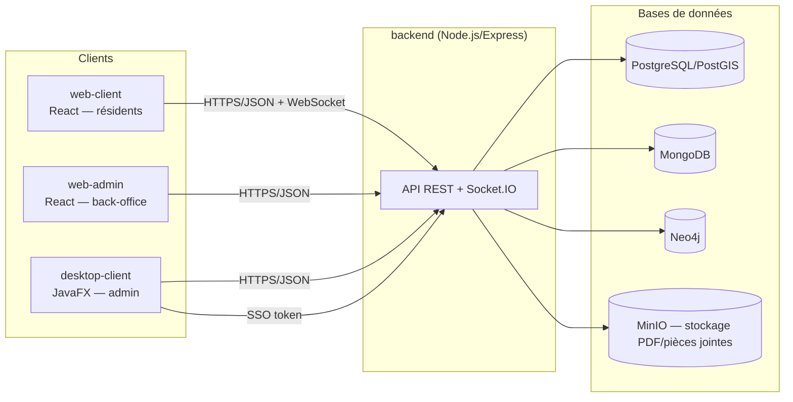
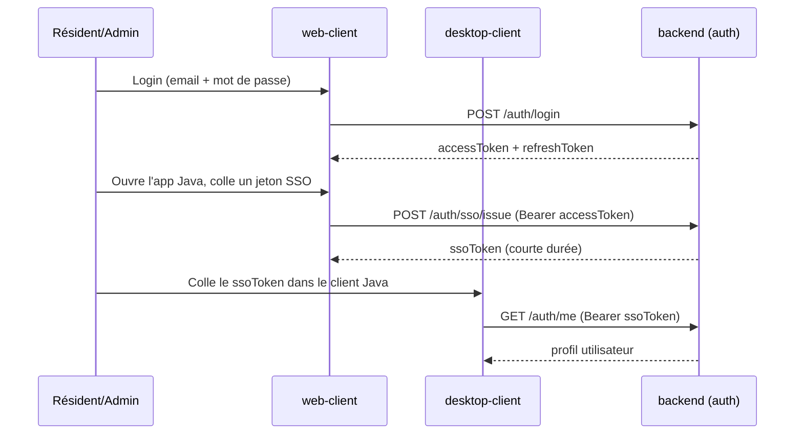

# Architecture — Connected Neighbours (Vicinity)

Ce document décrit l'organisation des applications, leurs interactions et l'architecture des conteneurs. Pour la modélisation des données, voir [database-model.md](database-model.md). Pour l'API, voir [api/openapi.yaml](api/openapi.yaml).

## Vue d'ensemble des applications

- **web-client** : application résidents (quartiers, annonces, événements, sondages, messagerie, documents, RGPD, incidents).
- **web-admin** : back-office (dessin des périmètres de quartier, portefeuille de points, supervision des documents).
- **desktop-client** : outil Java de l'administrateur (incidents/alertes, statistiques de participation), offline-first via une base H2 locale, synchronisée avec le backend.
- **backend** : API unique consommée par les trois clients ; expose aussi une passerelle Socket.IO pour la messagerie et la présence temps réel.

## Authentification / SSO

Les actions sensibles (connexion si MFA activé, changement d'e-mail, signature de document) exigent en plus un code TOTP (`backend/src/auth/`).

## Architecture des conteneurs

`infra/docker/docker-compose.yml` définit 4 services de données, réseau partagé `cn_backend`, volumes nommés pour la persistance :

| Service | Image | Rôle | Port hôte |
|---|---|---|---|
| `postgres` | `postgis/postgis:16-3.4` | Utilisateurs, sessions, quartiers (PostGIS), transactions de points, audit | 55432 |
| `mongo` | `mongo:7.0` | Documents métier : annonces, événements, messages, sondages, votes, documents PDF, incidents | 57017 |
| `neo4j` | `neo4j:5.20-community` | Graphe social (relations `LIVES_IN`, `INTERESTED_IN`) pour les recommandations | 57687 (bolt) |
| `minio` | `minio/minio` | Stockage S3-compatible des PDF et pièces jointes de messagerie | 59000 |

Le backend (Node.js), `web-client` et `web-admin` (Vite/React) ne sont pas encore conteneurisés dans ce compose (ils tournent en local via `npm run dev` pendant le développement) ; seules les bases de données le sont. La CI (`.github/workflows/ci.yml`) build/teste chacune des trois briques (backend, web, desktop) séparément.

## API externe

Aucune API tierce n'est appelée directement par le backend à ce stade (toutes les données proviennent des bases internes ci-dessus). Le stockage de fichiers utilise le protocole S3 (compatible MinIO en dev, un vrai bucket S3 en prod si besoin).
