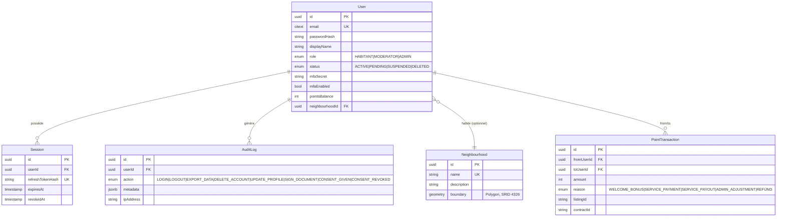
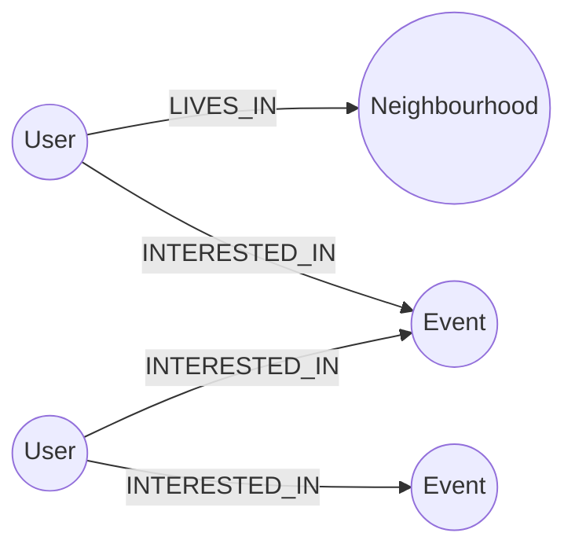

# Modélisation des bases de données

Trois bases sont utilisées, chacune pour ce à quoi elle est la plus adaptée (voir [architecture.md](architecture.md) pour la vue d'ensemble).

## 1. PostgreSQL / PostGIS (Prisma) — identité, géographie, transactions

Schéma source : `backend/prisma/schema.prisma`.

Points clés :
- `Neighbourhood.boundary` est un polygone PostGIS (`geometry(Polygon, 4326)`), interrogé via `ST_Contains`/`ST_Intersects`/`ST_Touches` (raw SQL, `backend/src/neighbourhood/repository.ts`) pour détecter les chevauchements de périmètres.
- `AuditLog` est la trace RGPD de toutes les actions sensibles (connexion, export, suppression, signature, consentement).
- Les listings/événements/contrats référencés dans `PointTransaction` (`listingId`/`contractId`) vivent côté MongoDB — pas de clé étrangère SQL, jointure applicative par identifiant opaque.

## 2. MongoDB (Mongoose) — documents métier

Une collection par domaine, chacune indexée sur `neighbourhoodId` quand pertinent (`backend/src/db/mongo/models/`) :

| Collection | Champs clés | Rôle |
|---|---|---|
| `listings` | authorId, neighbourhoodId, kind, category, pricePoints, status | Petites annonces (offres/demandes de services) |
| `contracts` | listingId, payerId, payeeId, pricePoints, status | Contrat généré à l'acceptation d'une annonce payante |
| `events` | organizerId, neighbourhoodId, startsAt/endsAt, attendees, interested, declined, status | Événements de quartier + intérêt (swipe) |
| `messages` | conversationId, senderId, body, attachments[], readBy, deliveredTo | Messagerie (texte + pièces jointes photo/audio/fichier) |
| `polls` / `votes` | neighbourhoodId, pluginId, options[] / pollId, userId, choiceIndex | Sondages configurables par plugin + bulletins |
| `documents` | ownerId, storageKey, status, zones[], participants[] | Documents PDF, zones de signature, statut de signature |
| `incidents` | reporterId, neighbourhoodId, category, status | Incidents/alertes signalés par les résidents, gérés par l'admin (client Java) |

Les pièces jointes (`messages.attachments[].storageKey`) et les PDF (`documents.storageKey`) ne stockent qu'une clé opaque ; le contenu binaire est dans MinIO/S3 (`backend/src/storage/`).

## 3. Neo4j — graphe social et recommandations

Nœuds et relations (`backend/src/db/neo4j/constraints.ts`, `backend/src/events/neo4j.ts`) :

- `User.id`, `Event.id`, `Neighbourhood.id` : contraintes d'unicité (miroir des identifiants Postgres/Mongo — pas de duplication de données, juste les relations).
- `LIVES_IN` : rattache un utilisateur à son quartier.
- `INTERESTED_IN` : marqué/retiré via les routes `/events/:id/interest` et `/events/:id/decline`.
- Le moteur de recommandation (`recommendEvents`) trouve des événements intéressant des utilisateurs qui partagent au moins un centre d'intérêt commun avec l'utilisateur courant (collaborative filtering simple par 2 sauts de graphe).

## 4. Base locale H2 (client Java, offline-first)

`desktop-client/.../store/LocalStore.java` — un fichier H2 unique (`~/.vicinity/data/vicinity-desktop.mv.db`) :

| Table | Rôle |
|---|---|
| `app_session` | Jeton d'accès/rafraîchissement et profil utilisateur courant |
| `app_settings` | Préférences (thème, couleur d'accent, taille de police) |
| `neighbourhoods_cache` | Cache des quartiers (remplacement complet à chaque sync) |
| `incidents_cache` | Cache des incidents par quartier, avec `remote_updated_at` pour la détection de conflit |
| `incident_outbox` | File d'attente des changements de statut effectués hors-ligne, rejoués par `SyncService` |
| `stats_cache` | Cache des statistiques de participation par quartier |

La synchronisation est un remplacement complet (pull) pour les quartiers/incidents/stats, avec une résolution de conflit optimiste uniquement sur l'écriture (changement de statut d'incident) : le backend compare `updatedAt` et renvoie 409 si l'incident a été modifié entre-temps par quelqu'un d'autre.
